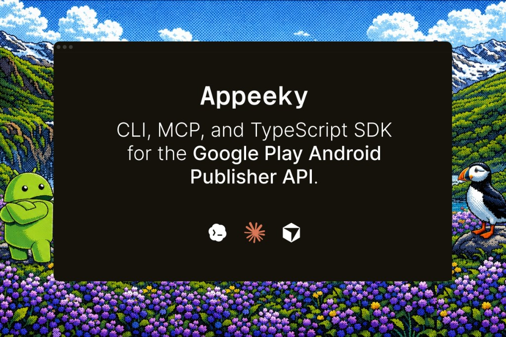

# Google Play Store CLI

**Powered by [Appeeky](https://appeeky.com).**

A scriptable **CLI + MCP** for the [Google Play Android Publisher API v3](https://developers.google.com/android-publisher).

Automate Android release workflows from your terminal, IDE, or CI — deploy builds, manage listings, reply to reviews, and operate monetization.

<p align="center">
  
</p>

| Package | Binaries | Role |
| ------- | -------- | ---- |
| [`@appeeky/google-play-store-cli`](https://www.npmjs.com/package/@appeeky/google-play-store-cli) | `gps`, `gps-mcp` | CLI + MCP server |

## Table of contents

- [Install](#install)
- [Quick start](#quick-start)
- [Multi-account](#multi-account)
- [Common workflows](#common-workflows)
- [MCP](#mcp)
- [gps skills](#gps-skills)
- [SDK](#sdk)
- [Documentation](#documentation)
- [Development](#development)
- [Contributing](#contributing)
- [License](#license)

## Install

```bash
npm install -g @appeeky/google-play-store-cli
```

This installs both binaries:

- `gps` — CLI
- `gps-mcp` — MCP server (stdio)

```bash
gps --help
gps-mcp --help
```

Also available with other package managers:

```bash
pnpm add -g @appeeky/google-play-store-cli
yarn global add @appeeky/google-play-store-cli
bun add -g @appeeky/google-play-store-cli
```

## Quick start

### 1. Authenticate

1. Create a Google Cloud **service account** and enable the Google Play Android Developer API.
2. Invite the SA email in Play Console → **Users and permissions**.
3. Download the JSON key (never commit it).

```bash
export GOOGLE_APPLICATION_CREDENTIALS=/path/to/service-account.json
gps whoami
```

Or:

```bash
gps --credentials /path/to/service-account.json whoami
```

Credential precedence: `--credentials` → `GPS_CREDENTIALS` / `GOOGLE_PLAY_CREDENTIALS` → `GOOGLE_APPLICATION_CREDENTIALS` → `~/.config/gps/config.json`.

### 2. First commands

```bash
gps --package com.example.app --json tracks list
gps --package com.example.app --json listings list
gps --package com.example.app --json reviews list
```

Writes need `--confirm`:

```bash
gps --package com.example.app deploy \
  --file ./app-release.aab \
  --track internal \
  --confirm
```

## Multi-account

One service-account key can access **many apps** (Play Console grants). Google Publisher API has **no** `list_apps` — register packages locally:

```bash
gps accounts add my-co --credentials /path/to/sa.json --default-package com.example.app --default
gps apps add com.example.app --account my-co --name "My App" --default
gps apps list
gps --account my-co tracks list
```

Details: [docs/authentication-accounts.mdx](./docs/authentication-accounts.mdx).

## Common workflows

### Releases

```bash
gps --package com.example.app deploy --file ./app.aab --track internal --confirm
gps --package com.example.app tracks promote --from internal --to beta --confirm
gps --package com.example.app tracks releases production --version-code 123 --json
gps --package com.example.app tracks rollout production --user-fraction 0.1 --confirm
gps --package com.example.app tracks halt production --confirm
```

### Reviews

```bash
gps --package com.example.app reviews list --json
gps --package com.example.app reviews reply REVIEW_ID "Thanks!" --confirm
```

### Listings

```bash
gps --package com.example.app listings list
gps --package com.example.app listings update en-US --title "My App" --confirm
```

### Monetization

```bash
gps --package com.example.app subscriptions list --json
gps --package com.example.app otp list
gps --package com.example.app iap list
```

### Full API surface

```bash
gps ops monetization
gps call gps_list_reviews '{"packageName":"com.example.app"}'
```

## MCP

```json
{
  "mcpServers": {
    "google-play-store": {
      "command": "gps-mcp",
      "args": ["--credentials", "/path/to/service-account.json"]
    }
  }
}
```

Read-only:

```bash
gps-mcp --read-only --credentials ./sa.json
```

See [docs/mcp/setup.mdx](./docs/mcp/setup.mdx).

## gps skills

Agent Skills for automating `gps` workflows including releases, listings, reviews, monetization, MCP, and troubleshooting.

```bash
gps install-skills
```

Or:

```bash
npx skills add ./skills --skill '*' -a cursor -a claude-code -g -y
```

Docs: [docs/skills/overview.mdx](./docs/skills/overview.mdx).

## SDK

The same Publisher client ships as a TypeScript SDK in this monorepo (`packages/core`, import `@appeeky/google-play-store-core`). It is bundled into the published CLI/MCP package and is not published separately on npm yet. See [docs/sdk/overview.mdx](./docs/sdk/overview.mdx).

## Documentation

- Site: [gps.appeeky.com](https://gps.appeeky.com)
- Source: [`docs/`](./docs)

```bash
cd docs && npx mintlify dev
```

## Development

```bash
git clone https://github.com/appeeky/google-play-store-cli.git
cd google-play-store-cli
pnpm install
pnpm build
pnpm test
pnpm typecheck
```

## Contributing

Contributions are welcome. See [CONTRIBUTING.md](./CONTRIBUTING.md) for setup, package layout, and testing notes.

## License

MIT — see [LICENSE](./LICENSE).

---

This project is an independent tool for the Google Play Android Publisher API and is not affiliated with, endorsed by, or sponsored by Google LLC. Google Play and Android are trademarks of Google LLC.
