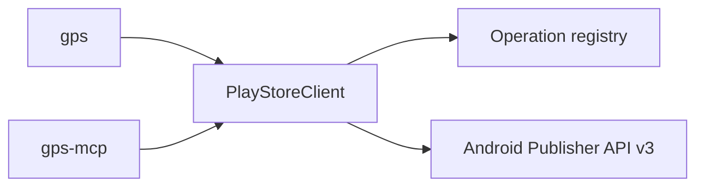

## Components

```
packages/
  core/   # PlayStoreClient, resource APIs, GPS_OPS
  cli/    # gps
  mcp/    # gps-mcp
```



## Design

1. All Google Play API calls go through `@appeeky/google-play-store-core`.
2. CLI and MCP only adapt arguments and schemas.
3. New coverage is added in core, then registered in `GPS_OPS` so MCP tools and `gps call` stay in sync.
4. Dedicated CLI subcommands are convenience wrappers for common workflows; the registry is the complete catalog.

## Extending

1. Add a method on the relevant resource class in core.
2. Register a `GpsOp` in the ops registry.
3. Optionally add a CLI subcommand.
4. MCP picks up the new tool automatically.

See [Contributing](/contributing).
